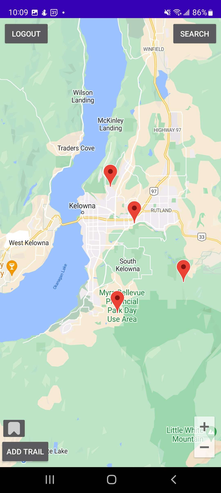

# Hikr - Prototype
This is a high fidelity prototype for Hikr. Hikr is an app designed to give users the ability to catalog their favorite hikes, discover new hikes based on their preferences and review hikes for other hikers to see.
## Functionality 
  - Make unique account
  - View map with hiking trail pins
  - Click on pins to get details about trail
  - Search trails by category
  - Add custom trails to the map that can be accessed from the map
 ## Possible Future Features
 - Seperate funtionality for Users and Admins
 - Directions given to user from current position
 - Database implementation to store global information (trails, account information)
 - Review system for users to rate their favorite trails
 - Favorite button to save trails for later
## Screenshots

 |
 |
 |
 |

## **Installation Instructions**
### **System Requirements:**
- Android device with an internet connection

### **Installation:**
1. Allow your browser to install unknown apps. For additional help on this, follow these [instructions](https://www.lifewire.com/install-apk-on-android-4177185)
1. Download the APK file from the APK folder
3. Enjoy!

### **Running the application**
- Create an account to access user functionality.
    - Type in a username and password and press create account
    - To view admin, type in the following credentials
        - Username: admin
        - Password: pass
